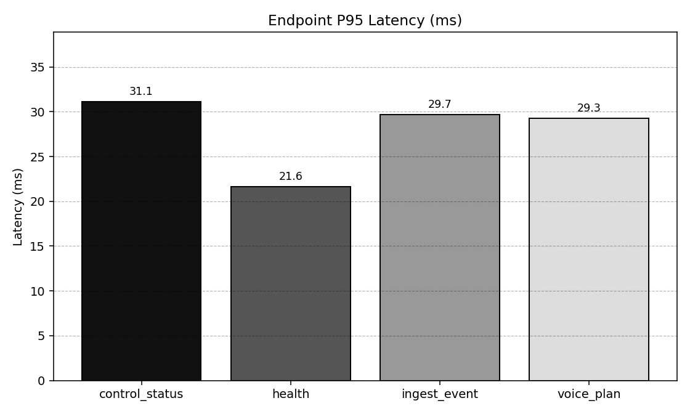
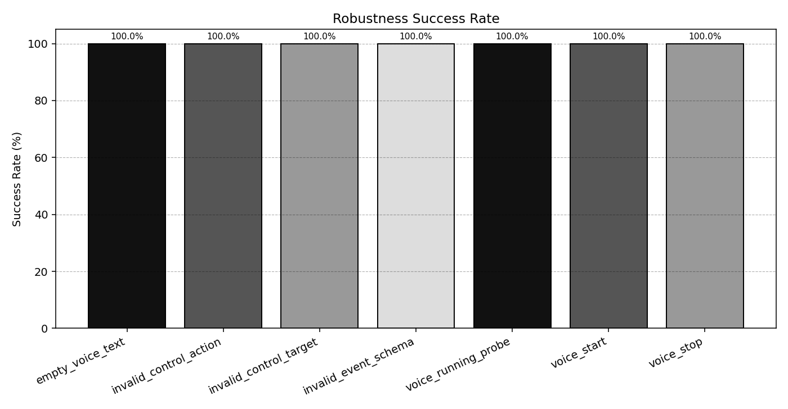

# 5.4 系统集成与测试（20分）

测试日期：2026-04-02  
测试对象：DripMotion Bridge + Web 交互链路（API/WS 控制通道）  
测试环境：Windows，Python 3.13.2，FastAPI(Uvicorn)

## 5.4.1 模块间接口测试（20分）

### A. 接口覆盖范围

- 健康检查：`GET /health`
- 模块状态：`GET /api/control/status`
- 事件注入：`POST /api/events`
- 语音规划：`POST /api/ai/voice-plan`
- 事件中继：`POST /api/events` -> `WebSocket /ws`

### B. 采样规模

- `health`：50 次
- `control_status`：50 次
- `ingest_event`：100 次
- `voice_plan`：30 次
- `event_to_ws`：30 次

### C. 结果表（接口时延与成功率）

| 接口 | 样本数 | 成功率 | 平均时延(ms) | P95(ms) | 最大时延(ms) |
|---|---:|---:|---:|---:|---:|
| control_status | 50 | 100.00% | 12.851 | 28.474 | 59.758 |
| health | 50 | 100.00% | 14.952 | 28.108 | 71.788 |
| ingest_event | 100 | 100.00% | 13.024 | 27.637 | 29.342 |
| voice_plan | 30 | 100.00% | 12.279 | 25.473 | 65.936 |
| event_to_ws（中继） | 30 | 100.00% | 0.245 | 0.425 | 0.528 |

### D. 图示

1. 主要接口 P95 时延图：

2. 结论（模块间接口）

- HTTP 接口层整体稳定，成功率均为 100%。
- 事件注入到 WebSocket 广播的中继时延非常低（P95 = 0.425ms），满足实时交互需求。
- `health` 与 `voice_plan` 存在个别高值（最大 71.788ms / 65.936ms），但 P95 仍控制在 30ms 以内，属于可接受波动。

---

## 5.4.2 功能完整性与鲁棒性测试（20分）

### A. 测试项

1. 非法参数鲁棒性：
- `invalid_control_target`
- `invalid_control_action`
- `invalid_event_schema`
- `empty_voice_text`

2. 控制链路稳定性：
- `voice_start` / `voice_running_probe` / `voice_stop` 循环 10 轮

### B. 结果表（鲁棒性）

| 测试项 | 样本数 | 通过数 | 成功率 | 说明 |
|---|---:|---:|---:|---|
| invalid_control_target | 1 | 1 | 100.00% | 正确返回 422 校验错误 |
| invalid_control_action | 1 | 1 | 100.00% | 正确返回 422 校验错误 |
| invalid_event_schema | 1 | 1 | 100.00% | 正确返回 422 校验错误 |
| empty_voice_text | 1 | 1 | 100.00% | 空白输入已在入参层拦截并返回 422 |
| voice_start | 10 | 10 | 100.00% | 接口调用稳定 |
| voice_running_probe | 10 | 10 | 100.00% | 状态接口稳定 |
| voice_stop | 10 | 10 | 100.00% | 停止接口稳定 |

### C. 图示

1. 鲁棒性成功率图：

### D. 关键发现

- `empty_voice_text` 已完成修复：`/api/ai/voice-plan` 对空白文本统一返回 422（参数校验层）。
- `voice_start` 后短时探测 `voice_running` 多数为 `false`，说明子进程可能快速退出（依赖/运行条件不足时的预期现象），但控制接口本身可用。

---

## 5.4 总体结论

1. 系统集成层（Bridge API + WS）通过，接口连通性与时延表现达到实时交互要求。
2. 模块间事件链路 `POST /api/events -> /ws` 可靠且低延迟，适合作为 Face/Hand/Web/Unity 的统一中枢。
3. 功能完整性方面，核心控制与状态功能可用；鲁棒性方面异常输入测试已全部通过（含空白文本场景）。
4. 当前版本无阻塞性接口鲁棒性缺陷，建议后续持续保留该回归用例防止回退。

---

## 附：原始数据文件

- `scripts/output/system_test_5_4/endpoint_latency_raw.csv`
- `scripts/output/system_test_5_4/ws_relay_raw.csv`
- `scripts/output/system_test_5_4/robustness_raw.csv`
- `scripts/output/system_test_5_4/summary.json`
