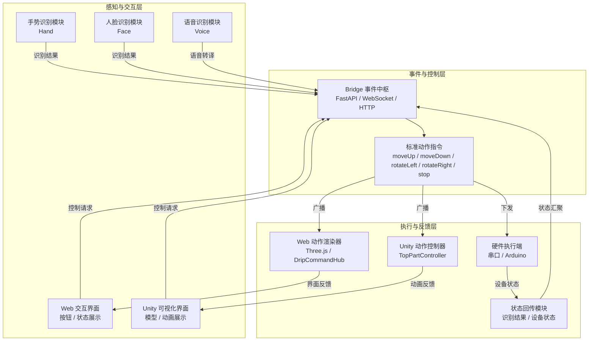
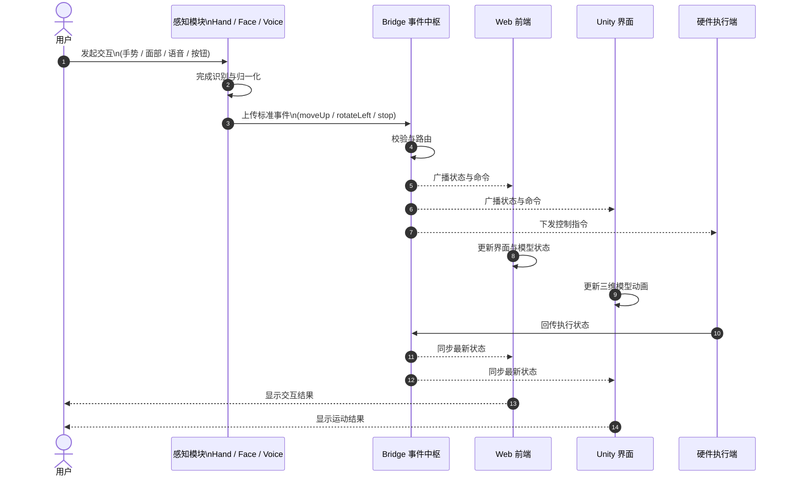

# 系统架构设计图与业务流程图

本文根据滴动仪智能交互系统的实现逻辑，对系统总体架构与业务流程进行归纳整理，并按照论文正文的表达方式给出图示说明，便于直接用于毕业设计、论文或答辩材料。

## 图1 系统总体架构图

图1展示了滴动仪智能交互系统的总体架构，系统按照“感知与交互层、事件与控制层、执行与反馈层”三层组织。感知与交互层负责采集手势、人脸、语音以及显式控制请求；事件与控制层完成指令归一化、协议封装与事件分发；执行与反馈层则将标准动作映射到 Web 动画、Unity 仿真和硬件设备，并将执行结果回传上层，形成闭环交互。

### 图1 图注说明

该架构强调多模态输入与多端执行之间的解耦关系。Bridge 作为统一事件中枢，承担跨模块通信和状态同步职责，从而降低前端展示层与底层识别、控制逻辑之间的耦合度，便于后续扩展更多识别方式或执行终端。

## 图2 系统业务流程图

图2描述了系统从用户发起交互到执行结果回传的完整业务流程。用户首先通过手势、面部动作、语音或按钮输入控制意图；随后感知模块完成识别并将结果转换为标准动作指令；Bridge 对指令进行接收、校验与分发；Web、Unity 和硬件执行端并行响应同一事件；最终，执行状态回传至系统上层，完成交互闭环。

### 图2 图注说明

该流程体现了系统“感知-识别-控制-执行-反馈”的完整链路。由于各执行终端共享统一的动作语义，因此同一控制指令可在不同终端上获得一致响应，保证系统行为的可解释性与一致性。

## 正文可直接引用的标准写法

如图1所示，滴动仪智能交互系统采用分层式架构设计，整体可划分为感知与交互层、事件与控制层以及执行与反馈层。感知与交互层负责接收来自手势、面部、语音和显式按钮的输入信息；事件与控制层负责完成动作语义归一化、协议封装和跨模块调度；执行与反馈层则将标准动作命令分别映射至 Web 前端、Unity 仿真界面及硬件执行端，并将执行状态回传至上层，形成闭环控制机制。该设计在保证功能完整性的同时，提高了系统的可扩展性与可维护性。

如图2所示，系统业务流程可概括为“用户输入、感知识别、指令转换、事件分发、终端执行与状态回传”六个阶段。用户通过任一输入方式发起交互后，感知模块输出标准化动作指令，Bridge 负责统一处理并分发至各执行终端，终端完成动作响应后再将状态反馈给系统，从而形成持续交互的闭环流程。

## 推荐使用方式

- 如果用于论文正文，建议直接使用以上两张 Mermaid 图。
- 如果用于答辩或排版稿，可先导出为图片后嵌入 Word 或 PPT。
- 若需要进一步规范格式，可将图题改为“图1 系统总体架构图”和“图2 系统业务流程图”，并在正文中按“如图1所示”“如图2所示”进行交叉引用。

## 相关章节

- [3.2 面部识别方法（原理、公式与关键点定义）](docs/chapter_3_2_face_recognition_method.md)
