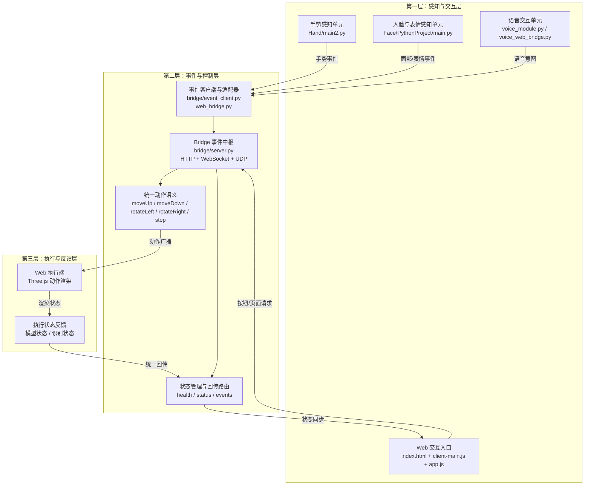
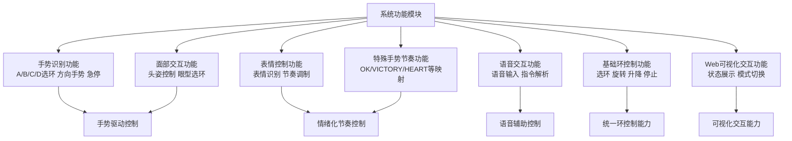
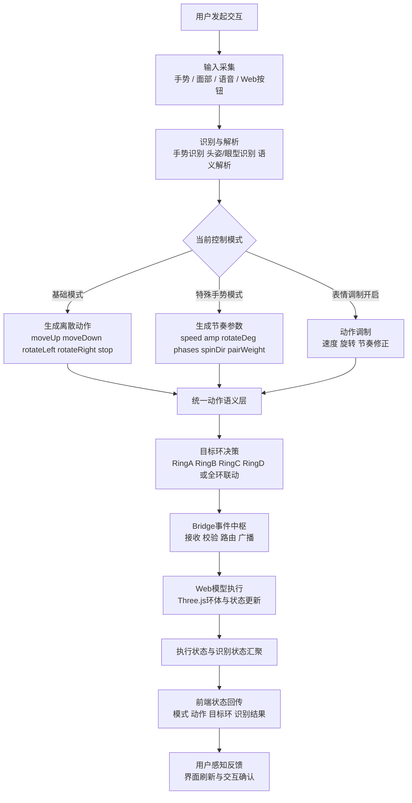
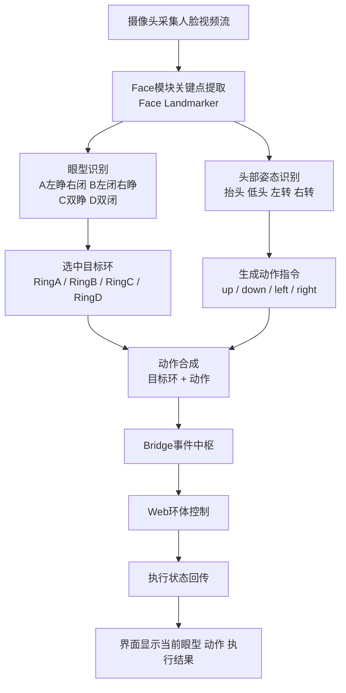
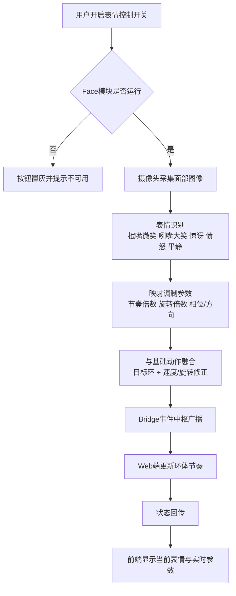
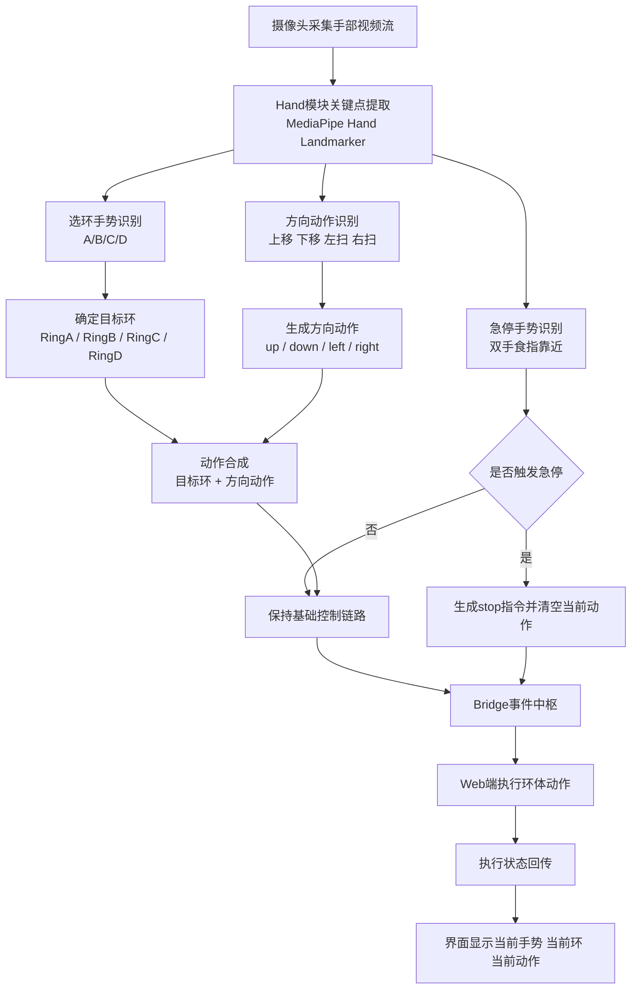
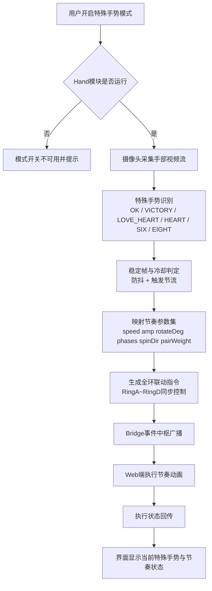

# 系统架构设计图与业务流程图

本文根据滴动仪智能交互系统的实现逻辑，对系统总体架构与业务流程进行归纳整理，并按照论文正文的表达方式给出图示说明，便于直接用于毕业设计、论文或答辩材料。

## 图1 系统总体架构图

图1展示了滴动仪智能交互系统的总体架构。系统采用三层解耦设计：上层为“感知与交互层”，负责多模态输入采集与控制请求发起；中层为“事件与控制层”，负责动作语义统一、路由分发与状态同步；下层为“执行与反馈层”，负责 Web 模型动作执行与状态回传。该分层结构可在保证实时性的同时提升系统扩展性与可维护性。

### 图1 图注说明

该架构突出“输入解耦、控制统一、执行并行”的设计思想。Bridge 作为中间层核心组件，对上屏蔽不同输入模态差异，对下提供统一控制语义，使系统具备良好的模块独立性和工程扩展能力。需要说明的是，摄像头属于感知输入设备，不属于执行端。论文撰写时可在正文中按“感知与交互层-事件与控制层-执行与反馈层”顺序展开阐述，并结合图1进行交叉引用。

## 图1-1 系统功能模块图

图1-1用于描述系统在用户交互层面的核心功能构成。该图不强调执行链路与部署结构，仅展示系统已经实现的功能模块及其协同关系。

### 图1-1 图注说明

系统已实现的核心功能可归纳为手势识别、面部交互、表情控制、语音交互、基础环控制、特殊手势节奏和Web可视化交互七类。该图以“功能实现”而非“执行链路”为重点，便于在论文中直接说明系统具备的交互能力与控制能力。

## 图2 系统业务流程图

图2用于说明系统从用户输入到模型执行再到状态回传的完整业务闭环。流程覆盖多模态输入、模式判定、动作生成、事件分发与可视化反馈等关键环节。

### 图2 图注说明

该图体现系统业务的主闭环机制：多模态输入先统一为动作语义，再根据模式策略完成目标环决策并驱动模型执行，最后通过状态回传实现可视化反馈与交互确认。其核心特点是“输入异构、语义统一、策略分支、闭环反馈”。

## 图3 面部识别控制环流程图

图3用于说明通过面部特征直接控制环体的业务流程，核心包括眼型选环与头部方向动作映射。

### 图3 图注说明

该图强调“眼型负责选环、头姿负责动作”的双通道控制机制，可实现免手势的人脸驱动环控制。

## 图4 表情控制环流程图

图4用于说明“表情控制开关开启”后的节奏调制流程。系统根据识别表情动态调整节奏参数，并对目标环或环组执行同步控制。

### 图4 图注说明

该图反映表情作为高层调制信号参与控制闭环。表情不直接替代动作语义，而是对动作执行速度、旋转强度和节奏形态进行动态修正。

## 图5 手势基础控制环流程图

图5用于说明“手势基础模式”下的控制流程，核心为“手势选环 + 方向动作执行 + 急停处理”。

### 图5 图注说明

该图体现基础手势控制中的双路径机制：常规路径负责选环与方向控制，异常路径负责急停优先级抢占，从而保障控制安全性与响应实时性。

## 图6 手势特殊节奏控制环流程图

图6用于说明“特殊手势模式”下的全环联动流程。该模式下系统关闭基础选环与方向动作，改为“单手势驱动一套节奏参数”。

### 图6 图注说明

该图强调特殊手势模式的“参数编排驱动”特征。控制语义由离散方向动作提升为节奏模板切换，有利于实现更具表现力的联动动作。

## 正文可直接引用的标准写法

如图1所示，滴动仪智能交互系统采用分层式架构设计，整体可划分为感知与交互层、事件与控制层以及执行与反馈层。感知与交互层负责接收来自手势、面部、语音和显式按钮的输入信息；事件与控制层负责完成动作语义归一化、协议封装和跨模块调度；执行与反馈层则将标准动作命令映射至 Web 前端模型，并将执行状态回传至上层，形成闭环控制机制。该设计在保证功能完整性的同时，提高了系统的可扩展性与可维护性。

如图1-1所示，系统功能层面主要包括手势识别、面部交互、表情控制、语音交互、基础环控制、特殊手势节奏和Web可视化交互等模块。各功能模块共同构成多模态人机交互能力，并支持对环体运动的统一控制与模式切换。

如图2所示，系统业务流程可概括为“多模态输入、识别解析、模式判定、动作生成、事件分发、模型执行与状态回传”七个阶段。系统在统一语义层完成跨输入通道的融合，并通过模式分支机制兼容基础控制、特殊手势节奏与表情调制三类交互策略。

如图3所示，面部识别控制流程采用“眼型选环 + 头姿动作”的组合机制：眼型决定目标环，头部姿态决定动作方向，二者在Face模块合成标准事件后由Bridge统一分发，实现免手势控制。

如图4所示，表情控制流程属于对基础控制的高层调制链路。系统在识别到表情后，根据映射规则动态调整节奏与旋转参数，再将修正后的指令广播到各执行端，从而实现具有情绪风格的环体运动。

如图5所示，手势基础控制流程采用“手势选环 + 方向动作”的主链路，并通过双手急停手势建立高优先级中断机制。当急停触发时，系统立即下发停止指令并覆盖当前动作队列。

如图6所示，手势特殊节奏流程在模式开启后禁用基础选环与方向动作，转而根据识别到的特殊手势加载对应节奏参数集，驱动四环联动执行，从而实现风格化运动控制。

## 推荐使用方式

- 如果用于论文正文，建议直接使用以上六张 Mermaid 图。
- 如果用于答辩或排版稿，可先导出为图片后嵌入 Word 或 PPT。
- 若需要进一步规范格式，可将图题统一为“图1 系统总体架构图”“图2 系统业务流程图”“图3 面部识别控制环流程图”“图4 表情控制环流程图”“图5 手势基础控制环流程图”“图6 手势特殊节奏控制环流程图”，并在正文中按“如图X所示”进行交叉引用。若后续启用 Unity 联调，可作为扩展终端另行补充。

## 相关章节

- [3.2 面部识别方法（原理、公式与关键点定义）](docs/chapter_3_2_face_recognition_method.md)
