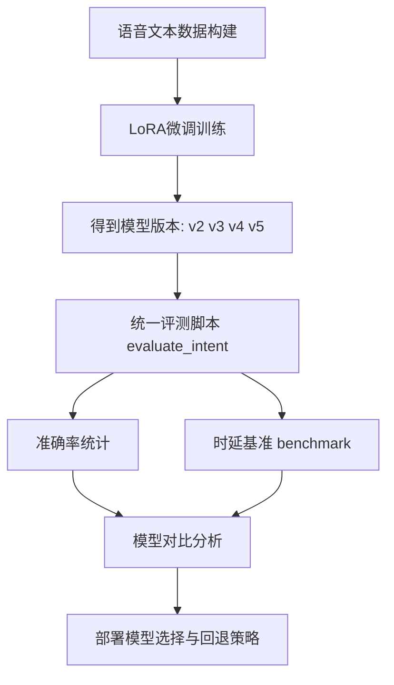
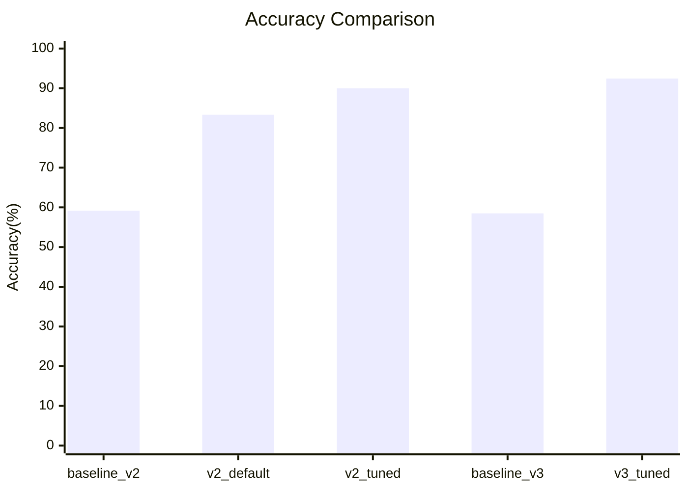
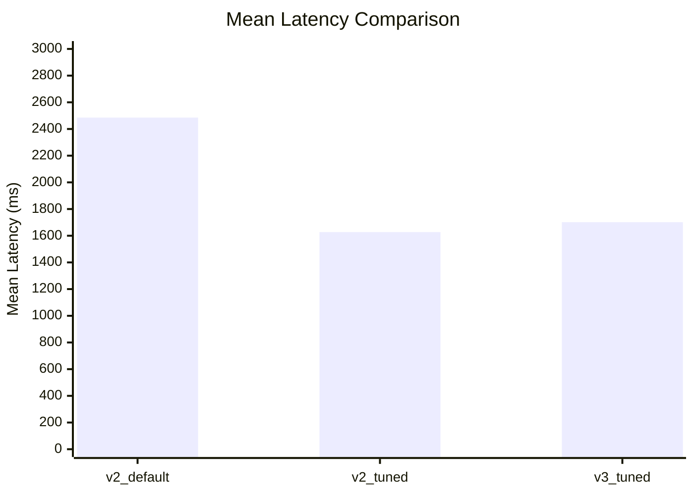

# 第四章 语音大模型训练与测试结果

本章围绕语音交互任务中的大模型训练流程与测试表现进行系统阐述，目标是回答三个关键问题：其一，轻量化微调是否能显著提升中文语音指令理解准确率；其二，模型在多版本迭代中的性能变化是否稳定；其三，在CPU推理条件下系统是否具备工程可用性。为此，本文采用统一数据口径与统一评测脚本，对规则基线、阶段性模型和五次训练产物进行了横向比较，并结合准确率与时延指标给出部署结论。

## 4.3 语音大模型训练与测试

语音意图识别任务被定义为“语音文本到控制命令”的多分类问题，命令空间为11类标准动作。训练方案采用LoRA对Qwen2.5-0.5B-Instruct进行参数高效微调，测试方案分为两层：第一层是阶段性训练效果评估，第二层是五次训练产物统一复检。该设计能够同时反映模型能力上限与工程迭代稳定性。

### 4.3.1 训练方案与实验设置

在训练阶段，系统以中文口语化命令为主要样本来源，覆盖同义表达、礼貌表达和口语变体，尽可能逼近真实交互场景。模型输出被约束为结构化JSON，包含command与confidence字段，便于后续自动化评测与运行时阈值控制。相较于全参数微调，LoRA方案在显存成本与训练效率之间具备更高性价比，适用于本课题的快速迭代需求。

图4-1展示了本研究采用的训练与测试闭环流程。从流程上看，系统首先完成数据构建与LoRA训练，然后进入统一脚本评估，最终形成“精度-时延-部署建议”三位一体的结论输出。

**图4-1 语音大模型训练与测试流程图**

为保证实验可复现，本文将核心配置参数固定化。表4-1给出了训练与推理阶段的关键配置。

**表4-1 训练与推理关键配置**

| 配置项 | 典型值 | 说明 |
|---|---|---|
| 基座模型 | Qwen2.5-0.5B-Instruct | LoRA微调的基础模型 |
| 训练轮次 | 1 epoch | 单次迭代快速验证策略 |
| 批大小 | 2 | 结合显存约束设置 |
| 梯度累积 | 8 | 等效放大批次稳定训练 |
| 最大序列长度 | 384 | 兼顾指令信息与计算成本 |
| 推理长度上限 | max_new_tokens=8/48 | 影响时延和输出稳定性 |

### 4.3.2 准确率测试结果与版本对比

准确率评估采用统一测试集与统一脚本，避免因数据口径和调用方式差异引入偏差。结果显示，微调模型相对规则基线存在显著优势。以test_augmented_v3为例，规则方法准确率为58.49%，而v3微调模型达到92.45%，绝对提升33.96个百分点，说明模型对自然语言变体具备更强泛化能力。

图4-2给出了阶段性实验准确率趋势，表4-2汇总了关键对比数据。可以观察到，随着训练策略与数据增强优化，模型性能从v2_default逐步提升到v3_tuned，形成较清晰的上升轨迹。

**图4-2 阶段性准确率对比图**

**表4-2 阶段性准确率评测结果**

| 实验 | 模型 | 数据集 | 样本数 | 正确数 | 准确率 |
|---|---|---|---:|---:|---:|
| baseline_v2 | 规则回退 | test_augmented_v2 | 120 | 71 | 59.17% |
| v2_default | v2 LoRA | test_augmented_v2 | 120 | 100 | 83.33% |
| v2_tuned | v2 LoRA（调参） | test_augmented_v2 | 120 | 108 | 90.00% |
| baseline_v3 | 规则回退 | test_augmented_v3 | 159 | 93 | 58.49% |
| v3_tuned | v3 LoRA（强化训练） | test_augmented_v3 | 159 | 147 | 92.45% |

在五次训练统一复检中，v3、v5和v4形成明显梯度，其中v3保持最佳准确率。该结果表明，训练“次数足够”并不必然带来单调增益，数据分布、参数设置与随机性共同决定最终泛化表现。

**表4-3 五次训练模型统一复检结果**

| 模型目录 | 正确数 | 总数 | 准确率 |
|---|---:|---:|---:|
| latest | 125 | 159 | 78.62% |
| v2 | 125 | 159 | 78.62% |
| v3 | 147 | 159 | 92.45% |
| v4 | 137 | 159 | 86.16% |
| v5 | 144 | 159 | 90.57% |

### 4.3.3 推理时延与部署建议

在实时性评估中，本文采用CPU环境进行基准测试，统计Mean、P50、P95和P99时延。结果显示，生成长度约束对时延优化作用明显：v2_default平均时延为2485.58 ms，而在max_new_tokens=8后，v2_tuned降至1627.23 ms。v3_tuned在更高准确率下平均时延为1701.88 ms，P95为2296.01 ms，说明其在精度与响应速度之间实现了较优折中。

图4-3展示了不同配置下的平均时延变化趋势。结合准确率结果可以得出：v3是当前精度优先场景的首选部署模型，v5可作为稳健备份模型；latest与v2在统一口径下准确率偏低，不建议作为默认在线模型。

**图4-3 推理平均时延对比图（CPU）**

在工程落地上，系统已将默认模型目录设置为v3，并保留规则回退链路与阈值控制机制，确保在模型不可用或低置信度情况下仍能维持基本交互能力。该策略兼顾了精度优先与可用性优先两类场景，为后续推理加速和模型压缩提供了稳定基线。

## 4.4 本章小结

本章以“训练可复现、测试可量化、部署可落地”为主线，完成了语音大模型从训练到评测的完整论证。实验结果表明，LoRA微调方案在中文语音指令任务上相较规则方法具有显著精度优势，其中v3模型在统一复检中达到92.45%，为当前最佳部署选择。与此同时，CPU时延测试揭示了实时性优化空间，后续可通过更小模型、量化推理与推理框架优化进一步降低响应延迟，从而提升系统在强实时场景中的应用性能。