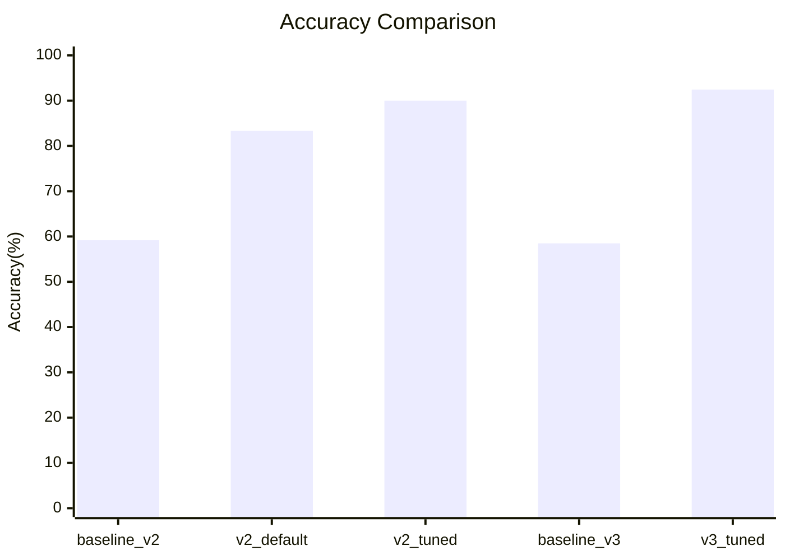
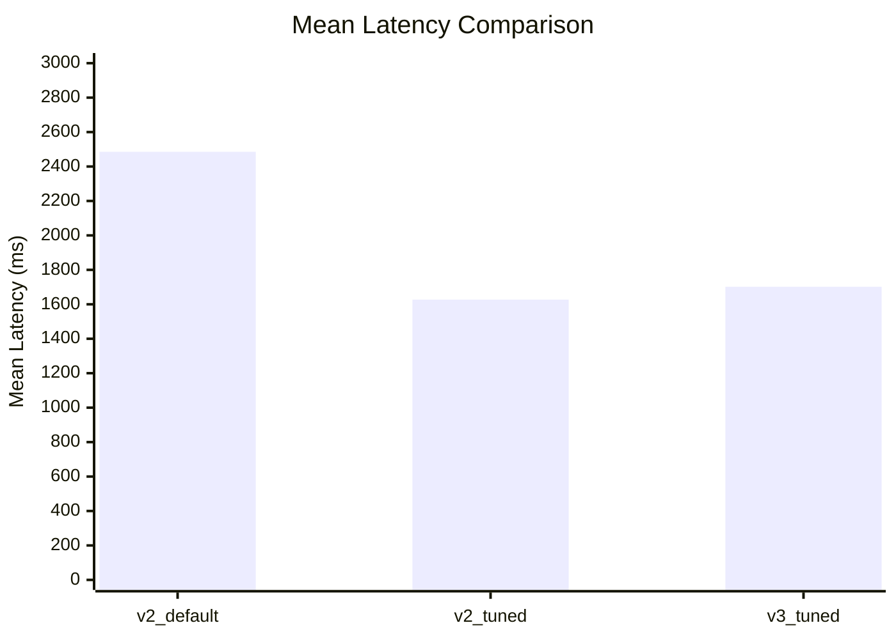

# 语音大模型训练结果（论文版）

## 1. 实验设置

- 任务：中文语音文本到设备控制命令的意图识别（11 类命令）。
- 训练方法：LoRA 微调（基座：Qwen2.5-0.5B-Instruct）。
- 评估方式：准确率（Accuracy）与推理时延（Mean/P50/P95/P99，单位 ms）。
- 对照组：规则回退（关键词匹配）。

## 2. 表格结果

### 表 1 语音意图识别准确率对比

| 实验 | 模型 | 数据集 | 样本数 | 正确数 | 准确率 |
|---|---|---|---:|---:|---:|
| baseline_v2 | 规则回退 | test_augmented_v2 | 120 | 71 | 59.17% |
| v2_default | v2 LoRA | test_augmented_v2 | 120 | 100 | 83.33% |
| v2_tuned | v2 LoRA（调参） | test_augmented_v2 | 120 | 108 | 90.00% |
| baseline_v3 | 规则回退 | test_augmented_v3 | 159 | 93 | 58.49% |
| v3_tuned | v3 LoRA（强化训练） | test_augmented_v3 | 159 | 147 | 92.45% |

### 表 2 推理时延对比（CPU）

| 实验 | 配置 | Calls | QPS | Mean | P50 | P95 | P99 |
|---|---|---:|---:|---:|---:|---:|---:|
| v2_default | 默认生成长度 | 130 | 0.40 | 2485.58 | 2395.47 | 2945.33 | 3543.68 |
| v2_tuned | max_new_tokens=8 | 130 | 0.61 | 1627.23 | 1613.77 | 1863.59 | 2283.10 |
| v3_tuned | max_new_tokens=8 | 130 | 0.59 | 1701.88 | 1650.19 | 2296.01 | 3042.09 |

## 3. 图形结果

### 图 1 准确率提升趋势



### 图 2 平均时延对比



## 4. 可直接写入论文的段落描述

### 4.1 结果总述（可直接引用）

本研究在中文语音控制任务上采用 LoRA 对 Qwen2.5-0.5B-Instruct 进行轻量化微调，并与规则回退方法进行对比。实验结果表明，模型方法在准确率上显著优于规则方法。以 v3 测试集为例，规则回退准确率为 58.49%，而 v3 微调模型达到 92.45%，绝对提升 33.96 个百分点，说明微调模型能够更好地覆盖口语化、礼貌化和变体表达。

### 4.2 训练阶段效果分析（可直接引用）

从版本迭代看，v2 默认配置已将准确率提升至 83.33%，通过推理参数优化后可达 90.00%。在 v3 阶段，针对困难样本进行定向数据增强后，模型进一步提升至 92.45%。该结果说明，除模型结构外，训练数据的覆盖广度与难例分布对最终性能有决定性影响。

### 4.3 实时性分析与局限（可直接引用）

尽管精度达到较高水平，CPU 环境下推理时延仍然偏高。优化前（v2 默认）平均时延为 2485.58 ms，经过生成长度约束后降至 1627.23 ms；v3 在同等约束下平均时延为 1701.88 ms，P95 为 2296.01 ms。由此可见，当前方案已满足较高识别准确性，但在严格实时交互场景中仍需进一步进行推理加速（如更小模型、推理框架优化或硬件加速）。

## 5. 原始数据文件

- 准确率汇总：见 `docs/results/voice_llm_accuracy_summary.csv`
- 时延汇总：见 `docs/results/voice_llm_latency_summary.csv`

## 6. 五次训练模型统一复检（2026-04-12）

### 6.1 复检目的

针对当前已训练产物（`latest`、`v2`、`v3`、`v4`、`v5`）进行同口径复检，确认“五次训练是否可用”并给出可部署建议。

### 6.2 复检配置

- 评测脚本：`python -m voice_llm.evaluate_intent`
- 测试集：`voice_llm/data/test_augmented_v3.jsonl`
- 样本数：159
- 运行模式：
    - `DRIP_VOICE_LLM_ENABLE=1`
    - `DRIP_VOICE_LLM_MODEL_DIR=voice_llm/models/<model>`
- 说明：本轮为统一准确率复检（同机同环境逐模型串行执行）。

### 6.3 复检结果（准确率）

| 模型目录 | 正确数 | 总数 | 准确率 |
|---|---:|---:|---:|
| latest | 125 | 159 | 78.62% |
| v2 | 125 | 159 | 78.62% |
| v3 | 147 | 159 | 92.45% |
| v4 | 137 | 159 | 86.16% |
| v5 | 144 | 159 | 90.57% |

### 6.4 结果解读（详细）

- 第一梯队为 `v3`（92.45%）与 `v5`（90.57%），其中 `v3` 仍是当前最佳精度模型。
- `v4` 为中等水平（86.16%），较 `v3` 有明显回落，说明第 4 次训练虽然成功产出，但参数/随机性下泛化能力不及 `v3`。
- `latest` 与 `v2` 完全同分（78.62%），说明当前 `latest` 与 `v2` 在该测试集上的行为接近，且明显弱于 `v3/v5`。
- 从“五次训练是否完成”的角度看，当前已形成 5 份可加载 LoRA 产物并完成统一复检；从“最优部署”角度，优先建议 `v3`，备选 `v5`。

### 6.5 可部署建议

- 精度优先：部署 `voice_llm/models/v3`。
- 稳健备份：保留 `voice_llm/models/v5` 作为候选。
- 不建议直接部署：`latest`、`v2`（精度偏低）。

### 6.6 复现实验命令

```powershell
Set-Location C:/Users/acer/Desktop/BS/Coding/Face/PythonProject
$models = @('latest','v2','v3','v4','v5')
foreach ($m in $models) {
    Write-Host "=== EVAL $m ==="
    $env:DRIP_VOICE_LLM_ENABLE='1'
    $env:DRIP_VOICE_LLM_MODEL_DIR = "C:/Users/acer/Desktop/BS/Coding/Face/PythonProject/voice_llm/models/$m"
    c:/Users/acer/Desktop/BS/Coding/.venv/Scripts/python.exe -m voice_llm.evaluate_intent --dataset voice_llm/data/test_augmented_v3.jsonl --max-print-errors 0
}
```
